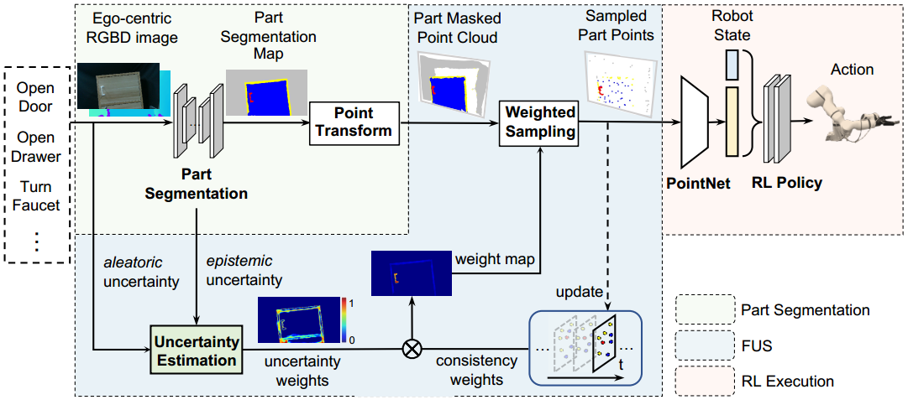

<h2 align="center">
  <b>Part-Guided 3D RL for Sim2Real Articulated Object Manipulation</b>

`<b><i>`RA-L 2023`</i></b>`

<div align="center">
    <a href="https://ieeexplore.ieee.org/abstract/document/10242361/" target="_blank">
    </a>
    <a href="https://arxiv.org/pdf/2404.17302" target="_blank">
    </a>
    <a href="https://www.youtube.com/watch?v=b8KvOjlGNJs" target="_blank">
    </a>
    <a href="https://www.bilibili.com/video/BV1aH4y1H7aQ/" target="_blank">
    </a>
</div>
</h2>

Official code of paper [Part-Guided 3D RL for Sim2Real Articulated Object Manipulation](https://ieeexplore.ieee.org/abstract/document/10242361/)

This project contains the implementation of our RA-L 2023 paper.


# About This Repo

The total framework consists of 3 parts: `Part Segmentation`, `3D Points Sampling`, `RL Policy Training & Evaluation`.

# Installation

This code has been tested on Ubuntu20.04 with Cuda 11.3, Python3.8 and Pytorch 1.11.0.
Environment: create a conda environment according to `arti_mani/docker/arti_mani.yaml` file (All requirements are specified in `arti_mani.yaml`).

```shell
cd arti_mani/docker
conda env create -f arti_mani.yaml 
```

Partnet Mobility Dataset: downloading from https://cloud.tsinghua.edu.cn/f/44f01920dcb44714b717/?dl=1.

# Training and Evaluation in Simulation

## Part Segmentation

```shell
# Data collection 
arti_mani/algorithms/data_process/gen_rgbd_data.py
# Models (finally we used SplitUnet) 
arti_mani/algorithms/visual_net/Networks/Custom_Unet.py
# Training and evaluation
arti_mani/algorithms/visual_net/scripts/
# configs
arti_mani/algorithms/config/smp_model.yaml
```

**Date Collection**: To get great evaluation results in simulation, `domain_random` and `random_bg_mode` could be set `False`, but they need to be set `True` if you want to get quite good results on real data.
**Segmentation Model**: We then built our model `SplitUnet` which is based on [segmentation-models-pytorch](https://github.com/qubvel/segmentation_models.pytorch.git). We decompose `RGB` and `Depth` feature processing in our encoders.

**Training**: We build our `SegDataset` in `arti_mani/algorithms/visual_net/scripts/dataset.py`, in which we added some data augmentation (e.g. Flip, RandomCrop, ColorJitter, GaussianNoise, etc.), which are mostly implemented using [albumentations](https://github.com/albumentations-team/albumentations). After that, we train the model in `arti_mani/algorithms/visual_net/scripts/train_seg.py`. More training details can be referred to `smp_model.yaml` and `train_seg.py`.

**Evaluation**: Performance is tested on validation data using `arti_mani/algorithms/visual_net/scripts/test_sim.py`, and is also tested with new data collected from simulation environment by `arti_mani/algorithms/visual_net/scripts/test_new.py`.

**Synthetic Dataset**:
You can run `arti_mani/algorithms/data_process/gen_rgbd_data.py` to generate the synthetic dataset, or directly download the dataset from [Synthetic Dataset](https://cloud.tsinghua.edu.cn/d/416c7eaed80448a09526/).

**Checkpoints**
You can directly use the checkpoints under `arti_mani/algorithms/visual_net/scripts/log/smp_model/20230219_000940_train52-val18_384_noDR_randombg_aug_stereo_bs16_focalloss_0.5step50lr0.001_RGBDunet-163264128_mobilenet_v2`. For further pretrained (maybe better for sim2real), you can download them from [Checkpoints](https://cloud.tsinghua.edu.cn/d/5ea9fd7747074511bb93/).

## RL Policy Training & Evaluation

```angular2html
# Training
arti_mani/algorithms/rl_iam/sac_train_segpts_PNfeat.py
# Evaluation
arti_mani/algorithms/rl_iam/sac_eval_segpts_PNfeat.py
```

**Training**: After training a good part segmentation model, you can then train the SAC policy:

```shell
cd arti_mani/algorithms/rl_iam/
python sac_train_segpts_PNfeat.py
```

You can change the `mode` in the script according your specified task (OpenDoor, OpenDrawer, TurnFaucet, HybridTask). The total 2M steps can be trained for about 7 hours in our `i9-13900K` and `RTX 3090` setting.

**Evaluation**: we get `success rate` and `mean steps` according the evaluation code in `arti_mani/algorithms/rl_iam/sac_eval_segpts_PNfeat.py`, and also get the rendered video and segmentation visualization results.

# Real Experiments

## Part Segmentation

We also collected about 200 real RGB-D images and annotated them using [Labelme](https://github.com/wkentaro/labelme). You can download with https://cloud.tsinghua.edu.cn/f/e1d2808c731c4440ba7e/?dl=1. We can evaluate the performance and visualize the uncertainty map by:

```shell
cd arti_mani/algorithms/visual_net/scripts
# you may need to change the REAL_DIR according to your real data dir. 
python test_real.py  
# visualize the uncertainty map, you also need to change the dir.
python test_real_uncertainty.py  
```

## RL Policy Execution

After training the RL policy, we can execute it in real experiments. You need to install the ROS package of `xmate3-pro`, and use the `JointImpedanceController`.

```shell
cd arti_mani/test/real_exps
# you may need to change the REAL_DIR according to your real data dir. 
python SB3_opencabinet.py
```

Other real codes:

```shell
cd arti_mani/test/real_exps
# replay the RL traj using ROS_ImpOpendoor
python realTRAJ_replay.py
# sim2real traj replay
python sim2real_replay.py
# real2sim traj replay
python real2sim_replay.py
```

In the end, we modify the xmate ros controller and robotiq controller code: `xmate3Robotiq.py` => `xmate3Robotiq_new.py`, which throw separate threads to control them simulataneously.

## Citation

If you find this code useful for your research, please use the following BibTeX entry.

```
@article{xie2023part3Drl,
  title={Part-Guided 3D RL for Sim2Real Articulated Object Manipulation},
  author={Xie, Pengwei and Chen, Rui and Chen, Siang and Qin, Yuzhe and Xiang, Fanbo and Sun, Tianyu and Xu, Jing and Wang, Guijin and Su, Hao},
  journal={IEEE Robotics and Automation Letters (RA-L)}, 
  year={2023}
}
```
